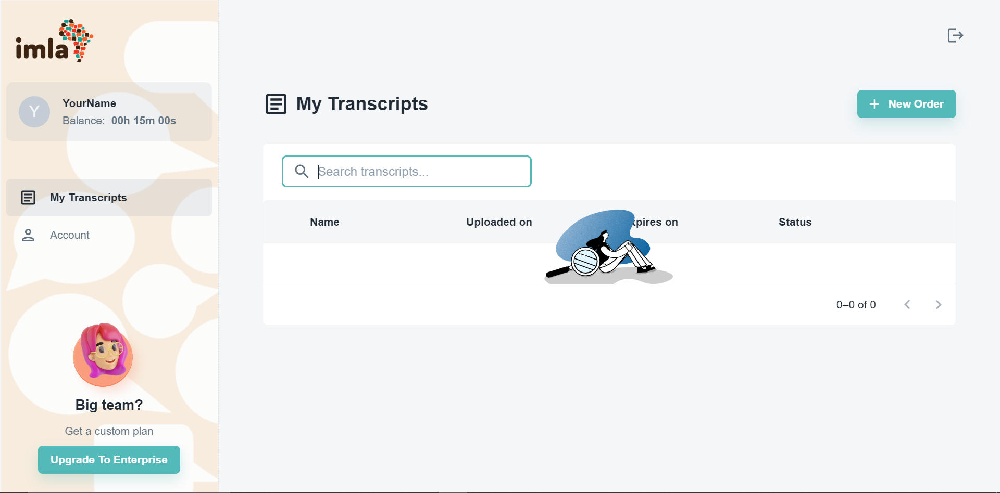
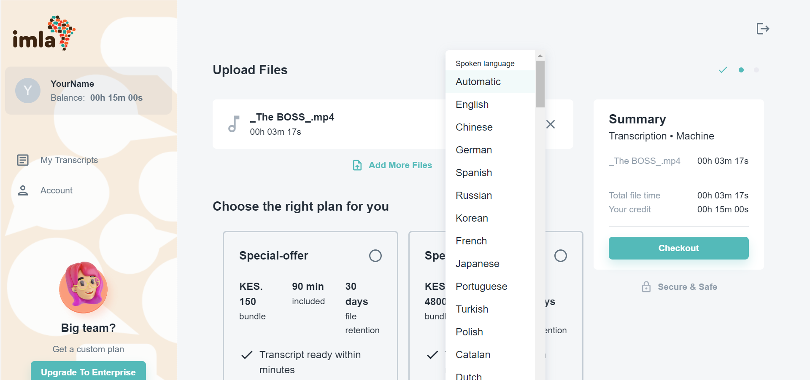
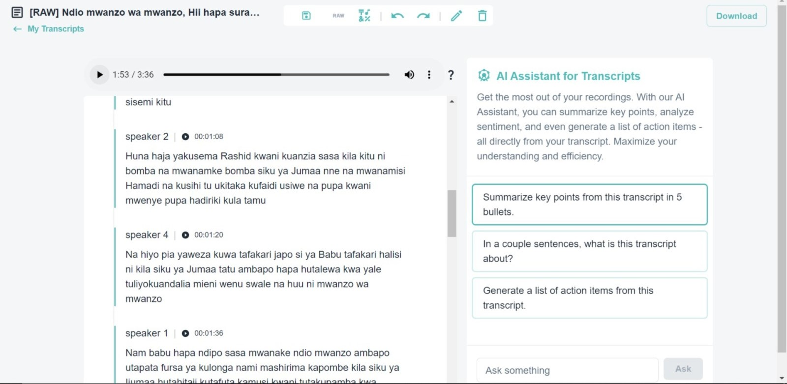

1. **Head over to Imla's lair:** Just pop open your browser and visit [imla](https://imla.io). Click the "Get Started" button, and you're halfway there!

2. **Craft your account:** Whip up a secure password and use a valid email address to register. Keep an eye on your inbox for a verification email – click that link to activate your account and get ready to roll.

3. **Time to unleash the audio:** Once verified, click the "New Order" button and choose your audio file from your device (think MP3s, WAVs – the usual suspects). Just remember, files can't be bigger than 500 MB.
   

4. **Checkout or choose your plan:** If you have some credits stashed away, hit "Checkout" in the summary section. Otherwise, pick a plan that suits your transcription needs and buy it using MPESA.
   

5. **Track your masterpiece's progress:** Boom! Your file is now chilling in the "My Files" section with an "In progress" status. When it switches to "Ready to Edit," your transcript is ready to shine!

6. **Polish and download:** Click "Ready to Edit" to review your transcript and make any tweaks. You can even use Imla's AI assistant to extract key points – fancy, right? Once you're happy, hit "Download" to save your transcript.
   

And there you have it! With these simple steps, you'll be churning out perfectly transcribed audio in no time. Now go forth and conquer that audio overload!
